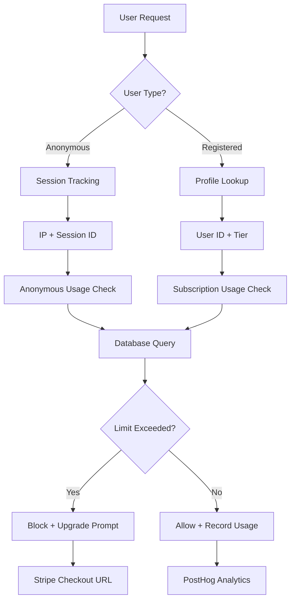

# Usage Tracking System Technical Documentation

## Overview

The Real Estate Pro Tools platform implements a comprehensive usage tracking system that monitors calculator usage for both anonymous and registered users. This system enforces daily calculation limits based on user tiers and provides detailed analytics for business intelligence.

## System Architecture

### Core Components

1. **Usage Tracking Engine** (`lib/auth/usage-tracking.ts`)
2. **Anonymous Session Management** (`lib/usage/session-tracking.ts`)
3. **Detailed Usage Analytics** (`lib/usage/tracking.ts`)
4. **Database Functions** (Supabase SQL functions)
5. **Subscription Management Integration** (`lib/payments/subscription-manager.ts`)

### Data Flow



## Anonymous User Tracking

### Session Management

Anonymous users are tracked through a sophisticated session management system that balances user privacy with usage limit enforcement.

#### Session Generation

```typescript
// Session ID generation using crypto.getRandomValues
export const generateSessionId = (): string => {
  const array = new Uint8Array(16)
  crypto.getRandomValues(array)
  return Array.from(array, byte => byte.toString(16).padStart(2, '0')).join('')
}
```

#### Browser Fingerprinting

```typescript
export const generateBrowserFingerprint = (): string => {
  const components = [
    navigator.userAgent,
    navigator.language,
    screen.width + 'x' + screen.height,
    screen.colorDepth,
    new Date().getTimezoneOffset(),
    navigator.cookieEnabled,
    navigator.doNotTrack || 'unspecified'
  ]
  return createHash('sha256').update(components.join('|')).digest('hex').substring(0, 16)
}
```

#### Session Storage

- **Location**: Browser localStorage
- **Key**: `rept_session`
- **TTL**: 24 hours
- **Structure**:
  ```typescript
  interface AnonymousSession {
    sessionId: string
    ipAddress?: string
    userAgent?: string
    referrer?: string
    createdAt: Date
    lastActivity: Date
    fingerprint: string
    metadata: {
      country?: string
      region?: string
      city?: string
      timezone?: string
    }
  }
  ```

### Usage Limits for Anonymous Users

- **Daily Limit**: 5 calculations
- **Reset Time**: Midnight UTC
- **Tracking Method**: IP address + session ID combination
- **Circumvention Protection**: Base IP analysis for detecting multiple IPs from same source

### Database Functions

#### `get_anonymous_usage(ip_addr TEXT, session_id TEXT)`

```sql
-- Returns count of calculations for the current day
-- Handles both development (local-*) and production IP formats
CREATE OR REPLACE FUNCTION get_anonymous_usage(ip_addr TEXT, session_id TEXT)
RETURNS INTEGER AS $$
DECLARE
  usage_count INTEGER;
  today_date DATE := CURRENT_DATE;
  base_ip TEXT;
BEGIN
  -- Extract base IP for pattern detection
  base_ip := CASE 
    WHEN ip_addr LIKE 'local-%' THEN split_part(ip_addr, '-', 1) || '-' || split_part(ip_addr, '-', 2)
    ELSE ip_addr
  END;
  
  -- Count calculations for this specific identifier
  SELECT COUNT(*)::INTEGER INTO usage_count
  FROM public.calculations
  WHERE ip_address = ip_addr
    AND user_id IS NULL
    AND DATE(created_at) = today_date;
  
  RETURN COALESCE(usage_count, 0);
END;
$$ LANGUAGE plpgsql SECURITY DEFINER;
```

#### Abuse Detection Function

```sql
-- Detects potential abuse patterns from anonymous users
CREATE OR REPLACE FUNCTION detect_usage_patterns(check_date DATE DEFAULT CURRENT_DATE)
RETURNS TABLE(
  base_identifier TEXT,
  unique_ips INTEGER,
  total_calculations INTEGER,
  avg_per_ip NUMERIC,
  potential_abuse BOOLEAN
)
```

This function identifies:
- Multiple IPs from same base network making excessive requests
- Patterns suggesting automated usage or limit circumvention
- Statistical anomalies in usage distribution

## Registered User Tracking

### User Tiers and Limits

```typescript
const DAILY_LIMITS = {
  free: 5,        // Same as anonymous but with account
  registered: 10, // Email confirmed users
  pro: Infinity   // Paid subscribers
}
```

### Subscription Integration

Registered users' usage limits are managed through the subscription system:

```typescript
// Usage check flow for registered users
export const checkUsageLimit = async (userId: string): Promise<UsageCheck> => {
  // 1. Get subscription details from Stripe
  const usageCheck = await subscriptionManager.checkUsageLimit(userId)
  
  // 2. Get current usage from profile
  const { data: profile } = await supabase
    .from('profiles')
    .select('daily_calculations_used, last_calculation_reset')
    .eq('id', userId)
    .single()

  // 3. Check if usage needs daily reset
  const today = new Date().toISOString().split('T')[0]
  const lastReset = profile?.last_calculation_reset
  const lastResetStr = lastReset ? new Date(lastReset).toISOString().split('T')[0] : null
  
  if (today !== lastResetStr) {
    currentUsed = 0 // Auto-reset for new day
  }

  // 4. Return comprehensive usage status
  return {
    allowed: usageCheck.allowed,
    remaining: usageCheck.remaining,
    used: currentUsed,
    limit: usageCheck.currentTier.limits.dailyCalculations,
    resetTime: usageCheck.resetTime,
    requiresUpgrade: usageCheck.requiresUpgrade,
    userType,
    checkoutUrl: usageCheck.checkoutUrl // For direct upgrade
  }
}
```

### Profile-Based Tracking

Registered users' usage is tracked in the `profiles` table:

```sql
-- Daily usage tracking fields
daily_calculations_used INTEGER DEFAULT 0 CHECK (daily_calculations_used >= 0),
last_calculation_reset DATE DEFAULT CURRENT_DATE,

-- Subscription information
subscription_tier TEXT DEFAULT 'free' CHECK (subscription_tier IN ('free', 'registered', 'pro')),
stripe_customer_id TEXT UNIQUE,
subscription_id TEXT,
subscription_status TEXT,
current_period_end TIMESTAMP WITH TIME ZONE,
```

### Automatic Daily Reset

Usage counters are automatically reset at midnight through the application logic:

```typescript
// Daily reset logic
const today = new Date().toISOString().split('T')[0]
const lastReset = profile?.last_calculation_reset
const lastResetStr = lastReset ? new Date(lastReset).toISOString().split('T')[0] : null

if (today !== lastResetStr) {
  // Reset usage counter for new day
  await supabase
    .from('profiles')
    .update({ 
      daily_calculations_used: 0,
      last_calculation_reset: today 
    })
    .eq('id', userId)
}
```

## Database Schema

### Core Tables

#### `profiles` Table
```sql
CREATE TABLE public.profiles (
  id UUID REFERENCES auth.users(id) ON DELETE CASCADE PRIMARY KEY,
  email TEXT,
  full_name TEXT,
  subscription_tier TEXT DEFAULT 'free',
  daily_calculations_used INTEGER DEFAULT 0,
  last_calculation_reset DATE DEFAULT CURRENT_DATE,
  
  -- Stripe integration
  stripe_customer_id TEXT UNIQUE,
  subscription_id TEXT,
  subscription_status TEXT,
  subscription_plan TEXT DEFAULT 'free',
  current_period_end TIMESTAMP WITH TIME ZONE,
  
  created_at TIMESTAMP WITH TIME ZONE DEFAULT NOW(),
  updated_at TIMESTAMP WITH TIME ZONE DEFAULT NOW()
);
```

#### `calculations` Table
```sql
CREATE TABLE public.calculations (
  id UUID PRIMARY KEY DEFAULT gen_random_uuid(),
  user_id UUID REFERENCES public.profiles(id) ON DELETE SET NULL,
  
  -- Calculator identification
  calculator_type TEXT NOT NULL CHECK (calculator_type IN (
    'sell-house', 'buy-house', 'mortgage-simulator', 
    'rental-investment', 'property-flip', 'switch-house'
  )),
  
  -- Data storage
  input_data JSONB NOT NULL DEFAULT '{}',
  result_data JSONB NOT NULL DEFAULT '{}',
  
  -- Anonymous tracking
  ip_address INET,
  session_id TEXT,
  user_agent TEXT,
  
  -- Analytics fields
  location TEXT,
  property_value NUMERIC(12,2),
  calculation_duration_ms INTEGER,
  browser_language TEXT DEFAULT 'pt',
  referrer TEXT,
  utm_source TEXT,
  utm_medium TEXT,
  utm_campaign TEXT,
  
  created_at TIMESTAMP WITH TIME ZONE DEFAULT NOW(),
  updated_at TIMESTAMP WITH TIME ZONE DEFAULT NOW()
);
```

### Row Level Security (RLS)

#### Anonymous User Policies
```sql
-- Allow anonymous users to insert calculations with IP tracking
CREATE POLICY "Anonymous users can insert calculations"
  ON public.calculations
  FOR INSERT
  TO anon
  WITH CHECK (user_id IS NULL AND ip_address IS NOT NULL);
```

#### Registered User Policies
```sql
-- Users can view their own calculations
CREATE POLICY "Users can view their own calculations"
  ON public.calculations
  FOR SELECT
  TO authenticated
  USING (auth.uid() = user_id);

-- Users can insert their own calculations
CREATE POLICY "Users can insert their own calculations"
  ON public.calculations
  FOR INSERT
  TO authenticated
  WITH CHECK (auth.uid() = user_id);
```

### Performance Indexes

```sql
-- Core performance indexes
CREATE INDEX idx_calculations_user_id ON public.calculations(user_id);
CREATE INDEX idx_calculations_ip_address ON public.calculations(ip_address, created_at);
CREATE INDEX idx_calculations_session_id ON public.calculations(session_id, created_at);
CREATE INDEX idx_calculations_anonymous_tracking 
  ON public.calculations(ip_address, session_id, created_at) 
  WHERE user_id IS NULL;

-- Analytics indexes
CREATE INDEX idx_calculations_calculator_type ON public.calculations(calculator_type);
CREATE INDEX idx_calculations_property_value ON public.calculations(property_value);
CREATE INDEX idx_calculations_utm_attribution 
  ON public.calculations(utm_source, utm_medium, utm_campaign, created_at);

-- JSONB indexes for flexible queries
CREATE INDEX idx_calculations_input_data ON public.calculations USING GIN (input_data);
CREATE INDEX idx_calculations_result_data ON public.calculations USING GIN (result_data);
```

## Usage Enforcement Flow

### Request Processing

1. **Request Arrives**: Calculator endpoint receives request
2. **User Identification**: Determine if user is anonymous or registered
3. **Usage Check**: Query appropriate usage tracking system
4. **Limit Enforcement**: Block or allow based on current usage
5. **Usage Recording**: Record successful calculation
6. **Analytics**: Send data to PostHog for business intelligence

### Implementation Example

```typescript
// Complete usage enforcement middleware
export const withUsageTracking = async (
  calculatorType: CalculationType,
  userType: UserType,
  userId?: string,
  context?: UsageContext
) => {
  // 1. Create or get usage context
  const usageContext = context || await createUsageContext()
  
  // 2. Check current usage against limits
  const usageLimit = await checkUsageLimit(
    userType,
    userId,
    usageContext.sessionId,
    usageContext.ipAddress
  )

  // 3. Return enforcement result with recording function
  return {
    usageLimit,
    context: usageContext,
    // Function to record successful calculation
    recordUsage: async (inputs, result, calculationTimeMs) => {
      if (result) {
        return await recordCalculationUsage(
          calculatorType,
          userType,
          usageContext,
          inputs,
          result,
          calculationTimeMs,
          userId
        )
      }
    }
  }
}
```

## Upgrade Flow Integration

### Blocking Modal System

When users reach their limits, they encounter a blocking modal that:

1. **Prevents further calculations** until upgrade or reset
2. **Shows time until limit reset** for current tier
3. **Provides direct upgrade path** with Stripe checkout URL
4. **Tracks conversion events** in PostHog for optimization

### Stripe Integration

```typescript
// Generate checkout URL for blocked users
const usageCheck = await checkUsageLimit(userId, ipAddress, sessionId)

if (!usageCheck.allowed && usageCheck.requiresUpgrade) {
  // Create Stripe checkout session
  const checkoutUrl = await createCheckoutSession(userId, 'price_pro_monthly')
  
  // Track blocking event for conversion analysis
  posthog?.capture('blocking_modal_shown', {
    user_type: usageCheck.userType,
    calculator_type: calculatorType,
    calculations_used: usageCheck.used,
    time_until_reset: usageCheck.resetTime
  })
  
  return {
    ...usageCheck,
    checkoutUrl
  }
}
```

## Caching Strategy

### In-Memory Cache

```typescript
// Usage cache for performance optimization
const usageCache = new Map<string, {
  count: number
  resetTime: Date
  lastUpdated: Date
}>()

const CACHE_TTL = 5 * 60 * 1000 // 5 minutes
```

### Cache Keys

```typescript
export const getRateLimitKey = (
  userId?: string,
  sessionId?: string,
  ipAddress?: string
): string => {
  if (userId) return `user:${userId}`
  if (sessionId) return `session:${sessionId}`
  if (ipAddress) return `ip:${ipAddress}`
  return `anonymous:${Date.now()}`
}
```

## Analytics and Reporting

### Usage Analytics

```typescript
export const getUsageAnalytics = async (
  userId: string,
  timeRange: 'day' | 'week' | 'month' = 'week'
): Promise<{
  totalCalculations: number
  calculationsByType: Record<CalculationType, number>
  dailyBreakdown: Array<{ date: string; count: number }>
  averageCalculationsPerDay: number
}>
```

### PostHog Integration

```typescript
// Track calculator usage
export const trackCalculatorUsage = (
  calculatorType: string,
  properties: Record<string, any> = {}
) => {
  posthog?.capture('calculator_used', {
    calculator_type: calculatorType,
    user_type: properties.user_type || 'anonymous',
    input_value_range: properties.input_value_range,
    location: properties.location,
    session_id: properties.session_id,
    ...properties,
  })
}

// Track usage limit events
export const trackUsageLimitReached = (properties: Record<string, any>) => {
  posthog?.capture('usage_limit_reached', {
    user_type: properties.user_type,
    calculator_type: properties.calculator_type,
    daily_usage: properties.daily_usage,
    time_of_day: new Date().getHours(),
    ...properties,
  })
}
```

## Security Considerations

### Data Privacy

1. **PII Sanitization**: Input data is sanitized before storage
2. **Anonymous Data Retention**: 90-day retention for anonymous calculations
3. **IP Address Hashing**: IP addresses can be hashed for additional privacy
4. **GDPR Compliance**: Users can request data deletion

### Abuse Prevention

1. **Fingerprint Validation**: Browser fingerprints prevent basic circumvention
2. **IP Pattern Analysis**: Detect multiple IPs from same source
3. **Rate Limiting**: Server-side rate limiting as backup
4. **Session Integrity**: Validate session data integrity

### Code Examples

#### Data Sanitization

```typescript
const sanitizeInputData = (inputs: Record<string, any>): Record<string, any> => {
  const sanitized = { ...inputs }
  
  // Remove potential PII
  delete sanitized.email
  delete sanitized.phone
  delete sanitized.name
  delete sanitized.address

  // Limit object size
  const serialized = JSON.stringify(sanitized)
  if (serialized.length > 5000) {
    return { _truncated: true, _originalSize: serialized.length }
  }

  return sanitized
}
```

#### Suspicious Activity Detection

```typescript
export const detectSuspiciousActivity = (
  session: AnonymousSession,
  currentFingerprint: string,
  currentUserAgent?: string
): { suspicious: boolean; reasons: string[] } => {
  const reasons: string[] = []
  let suspicious = false

  // Fingerprint mismatch
  if (session.fingerprint !== currentFingerprint) {
    suspicious = true
    reasons.push('Browser fingerprint mismatch')
  }

  // User agent change
  if (session.userAgent && currentUserAgent && session.userAgent !== currentUserAgent) {
    suspicious = true
    reasons.push('User agent changed during session')
  }

  return { suspicious, reasons }
}
```

## Maintenance and Monitoring

### Cleanup Tasks

```typescript
// Clean up old anonymous calculations
export const cleanupOldUsageRecords = async (daysToKeep: number = 90) => {
  const cutoffDate = new Date()
  cutoffDate.setDate(cutoffDate.getDate() - daysToKeep)

  const { data, error } = await supabase
    .from('calculations')
    .delete()
    .lt('created_at', cutoffDate.toISOString())
    .select('id')

  return { deletedCount: data?.length || 0 }
}
```

### Monitoring Queries

```sql
-- Daily usage statistics
SELECT 
  DATE(created_at) as date,
  COUNT(*) as total_calculations,
  COUNT(DISTINCT user_id) as unique_users,
  COUNT(*) FILTER (WHERE user_id IS NULL) as anonymous_calculations,
  COUNT(DISTINCT ip_address) FILTER (WHERE user_id IS NULL) as unique_ips
FROM calculations
WHERE created_at >= CURRENT_DATE - INTERVAL '7 days'
GROUP BY DATE(created_at)
ORDER BY date DESC;

-- Usage by calculator type
SELECT 
  calculator_type,
  COUNT(*) as usage_count,
  AVG(calculation_duration_ms) as avg_duration_ms,
  COUNT(DISTINCT user_id) as unique_users
FROM calculations
WHERE created_at >= CURRENT_DATE - INTERVAL '30 days'
GROUP BY calculator_type
ORDER BY usage_count DESC;

-- Potential abuse patterns
SELECT * FROM detect_usage_patterns(CURRENT_DATE);
```

## API Integration

### Usage Check Endpoint

```typescript
// API route: /api/usage/check
export async function POST(request: Request) {
  const { userId, ipAddress, sessionId } = await request.json()
  
  try {
    const usageCheck = await checkUsageLimit(userId, ipAddress, sessionId)
    
    return NextResponse.json({
      allowed: usageCheck.allowed,
      remaining: usageCheck.remaining,
      resetTime: usageCheck.resetTime.toISOString(),
      requiresUpgrade: usageCheck.requiresUpgrade,
      upgradeUrl: usageCheck.checkoutUrl
    })
  } catch (error) {
    return NextResponse.json(
      { error: 'Usage check failed' },
      { status: 500 }
    )
  }
}
```

### Usage Increment Endpoint

```typescript
// API route: /api/usage/increment
export async function POST(request: Request) {
  const { userId, calculatorType, inputData, resultData } = await request.json()
  
  try {
    // Record usage
    const record = await recordCalculationUsage(
      calculatorType,
      userId ? 'registered' : 'anonymous',
      await createUsageContext(getClientIP(request)),
      inputData,
      resultData,
      undefined,
      userId
    )
    
    // Update user's daily count if registered
    if (userId) {
      await incrementUserDailyUsage(userId)
    }
    
    return NextResponse.json({ 
      success: true, 
      calculationId: record.id 
    })
  } catch (error) {
    return NextResponse.json(
      { error: 'Usage recording failed' },
      { status: 500 }
    )
  }
}
```

## Troubleshooting

### Common Issues

1. **Cache Stale Data**: Clear usage cache for immediate updates
2. **Session Conflicts**: Check localStorage for corrupted session data
3. **IP Detection**: Verify proxy configuration for accurate IP detection
4. **Database Performance**: Monitor index usage and query performance

### Debug Functions

```typescript
// Debug usage state
export const debugUsageState = async (userId?: string, sessionId?: string) => {
  console.log('=== Usage Debug Info ===')
  console.log('User ID:', userId)
  console.log('Session ID:', sessionId)
  
  if (userId) {
    const profile = await getProfile(userId)
    console.log('Profile:', profile)
  }
  
  const session = getCurrentSession()
  console.log('Current Session:', session)
  
  const usageCheck = await checkUsageLimit(userId, undefined, sessionId)
  console.log('Usage Check:', usageCheck)
}
```

This documentation provides a complete overview of the usage tracking system implementation, covering both anonymous and registered user tracking, database design, security considerations, and operational procedures.